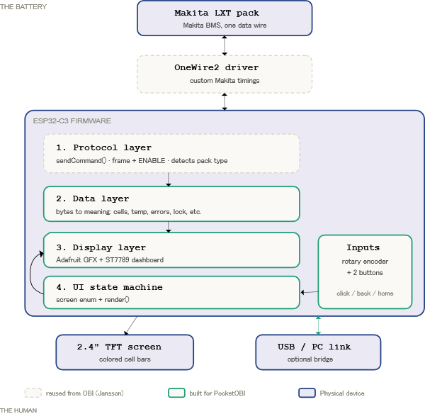
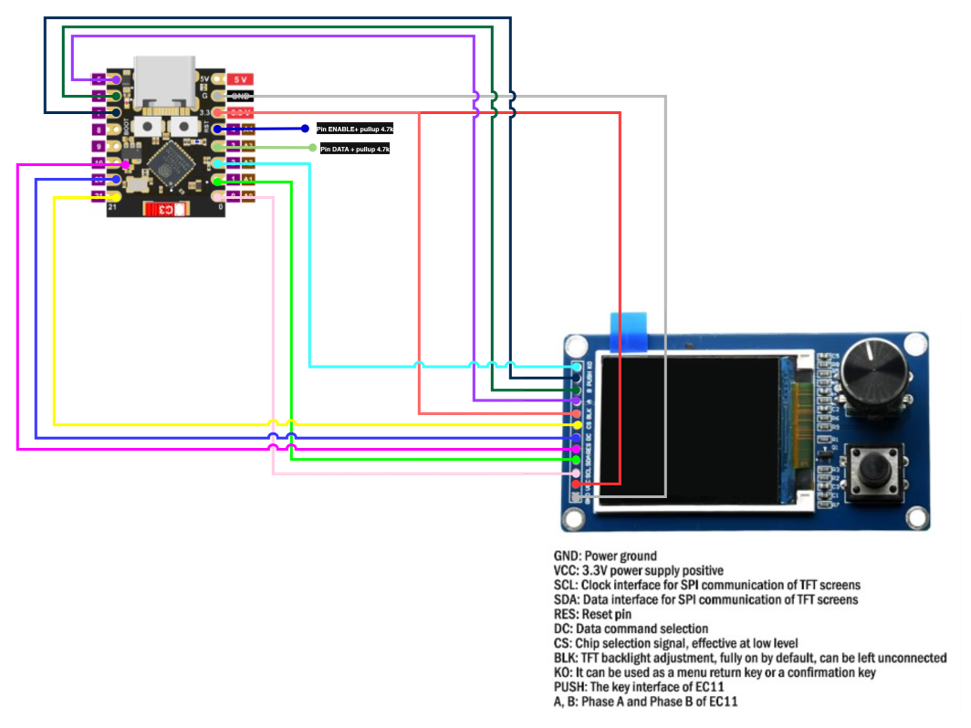

# PocketOBI

A standalone, screen-based reader and diagnostic tool for Makita LXT (18V)
batteries, running on an ESP32-C3 — no PC required. It reads cell voltages,
temperatures, charge count and error/lock state, and can reset false BMS
lockouts to rescue packs that are still good.

PocketOBI is a standalone **OBI client**: it speaks the same Makita OneWire
protocol documented by the [Open Battery Information](https://github.com/mnh-jansson/open-battery-information)
project, but as a self-contained handheld device with a TFT screen and a
rotary encoder instead of a computer.

Created by **The Repair Forge** — follow the build on YouTube:
https://www.youtube.com/channel/UCQL_-pcIEkrDPyljl3QPzcw

## Project status — Step 1 (beta)

This is **beta** and a work in progress. Expect rough edges; experimentation is
ongoing. Feedback and test reports (especially serial logs from real packs) are
very welcome.

> ⚠️ **Safety first.** These packs contain lithium cells and up to ~21 V on
> B+. **Never connect B+ to the ESP32.** Resetting a BMS error only helps a
> pack whose cells are actually healthy (a false lockout). Do **not** force a
> pack with a genuinely bad/low cell back into service — it is a fire risk.
> Use this tool at your own risk.

## Features

- Standalone reader with a menu-driven UI (rotary encoder + click, plus a
  secondary back button: short = back, long = home).
- Per-cell voltage bars with color-coded health (green / yellow / red) and
  imbalance detection.
- Pack voltage, estimated state of charge, cell and MOSFET temperatures, spread.
- Model, charge count, manufacturing date, capacity, error code, lock state.
- Automatic detection of standard vs older **F0513** BMS generations.
- Error reset with before → after feedback (full test-mode + power-cycle sequence).
- **Unlock / repair** : rewrites the frame to lift a charger lockout on a
  pack whose cells are healthy, clears the charger-lock nybble and recomputes
  the charger-validated checksums, then writes the frame back. See below.
- Pack LED test (on/off).
- Raw debug view (ROM ID + message frame).
- **PC bridge mode**: acts as a USB↔OneWire adapter (drop-in ArduinoOBI), so the
  desktop *Open Battery Information* app works through PocketOBI. Dual use:
  standalone tester **and** PC adapter.

## Architecture

*(click for full size — full-resolution file in [`docs/architecture.png`](docs/architecture.png))*

From the battery up: the Makita pack speaks over a single data wire; the bundled
**OneWire2** driver (reused from OBI) handles the custom Makita bit timings; the
ESP32-C3 firmware is layered — protocol (frames + ENABLE, pack-type detection),
data decode (bytes → cells / temperature / errors / lock), display (Adafruit GFX
+ ST7789) and a small UI state machine — driving the TFT and, optionally, a USB
PC bridge.

## Hardware

| Component | Notes |
|---|---|
| ESP32-C3 SuperMini | any ESP32-C3 board with native USB |
| 2.4" SPI TFT, ST7789 (240×320) | + integrated EC11 rotary encoder module |
| Makita BL1830 LXT adapter | clips onto the 18V pack |
| 2 × 4.7 kΩ resistors | pull-ups for DATA and ENABLE (470 Ω also works) |
| USB-C power (power bank/charger) | powers the tool — NOT the battery |

### Wiring

*(click for full size — full-resolution file in [`docs/wiring.png`](docs/wiring.png))*

**Display + encoder module (2-in-1 TFT + EC11):**

| ESP32-C3 | Module pin | Role |
|---|---|---|
| GPIO0  | SCL  | SPI clock |
| GPIO1  | SDA  | SPI data (MOSI) |
| GPIO10 | RES  | reset |
| GPIO20 | DC   | data / command select |
| GPIO21 | CS   | chip select (active low) |
| 3.3 V  | VCC  | logic power |
| 3.3 V  | BLK  | backlight (or leave unconnected = always on) |
| GND    | GND  | ground |
| GPIO5  | A    | encoder phase A |
| GPIO6  | B    | encoder phase B |
| GPIO7  | PUSH | encoder push button |
| GPIO2  | KO   | secondary button (short = back, long = home) |

**Battery adapter (Makita LXT connector):**

| ESP32-C3 | Battery pin | Role |
|---|---|---|
| GPIO3 + 4.7 kΩ pull-up to 3.3 V | Pin 2 — **DATA** | OneWire data |
| GPIO4 + 4.7 kΩ pull-up to 3.3 V | Pin 6 — **ENABLE** | enable (active high) |
| GND | main **B-** terminal | ground (sturdier than signal pin 5; same ground) |
| — | Pin 1 — **B+ (18 V)** | **NEVER CONNECT** |

Notes:
- **Pull-ups:** 4.7 kΩ is the reference value; **470 Ω** was used successfully on
  a breadboard (on 3.3 V logic the pack loads the DATA line near the input
  threshold, so a stronger pull-up can help with long/messy wiring).
- ⚠️ **Identify DATA/ENABLE by the ESP32 silkscreen labels ("3" / "4"), not by
  the adapter's connector position.** Some AliExpress adapters number their orange
  connector from the opposite end, so DATA can land on what looks like "plot 6"
  and ENABLE on "plot 2". Wrong plots = no comms (present = 0, all-`FF`/`00`).
- Power the tool from **USB-C**, never from the Makita pack (B+ is 18 V, and the
  BMS can cut its own output on error).

A carrier-PCB design (netlist, BOM, footprints, KiCad quick-start) is drafted in
[HARDWARE.md](HARDWARE.md) — not manufactured yet.

## Build & flash (Arduino IDE)

1. Install the **ESP32 board package** (Espressif) via the Boards Manager.
2. Install these libraries via the Library Manager:
   - Adafruit GFX Library
   - Adafruit ST7735 and ST7789 Library
   - RotaryEncoder (by Matthias Hertel)
   - (OneWire2 is bundled in this repo — nothing to install.)
3. Open `PocketOBI/PocketOBI.ino`.
4. Board: **ESP32C3 Dev Module**, USB CDC On Boot: **Enabled**.
5. Upload.

> Note: Arduino requires the sketch to live in a folder named `PocketOBI`.
> If you downloaded a ZIP (GitHub adds a `-main` suffix), rename the inner
> sketch folder back to `PocketOBI` before opening it.

## Usage

Power the tool over USB, connect DATA / ENABLE / GND to the pack (never B+),
and it reads automatically. Turn the encoder to navigate, click to select.
If the home screen shows "No battery found", check wiring and use
Menu → Read battery. "Comm error" / all-`0xFF` means the pack's BMS is not
responding (dead, or not an OBI-compatible pack).

## Unlock / repair

Some packs refuse to charge even though their cells are healthy and balanced:
the BMS stores a frame that trips the charger's lock. The Makita charger only
validates **three** fields of the 32-byte frame:

- **nybble 34** (byte 17, low) — the charger lock, must be `0`;
- **CS0** (nybble 41) — `sum(nybbles 0–15) & 0x0F`;
- **CS2** (nybble 43) — `sum(nybbles 32–40) & 0x0F`.

The status byte (byte 19, e.g. `0xA5`) and the reported temperatures are **not**
part of that check. The battery's own internal lock additionally checks **CS1**
(nybbles 16–31, per the rosvall protocol docs), so the repair recomputes all
three checksums. The Unlock / repair menu entry clears nybble 34, recomputes
CS0/CS1/CS2, writes the frame back (arm → write → store) and clears the internal
error register. The failure code (nybble 40, e.g. `0xF` = dead) is **never**
cleared — a genuinely dead pack is not forced back into service. Manufacturing/status bytes are never touched, and if the frame
is already valid no write is performed.

## Note on temperature units

Temperatures are decoded as **1/10 K** (`T_C = raw / 10 - 273.15`), following the
[rosvall protocol docs](https://codeberg.org/rosvall/makita-lxt-protocol) and the
obi-esp32 encoding. The original Open Battery Information app decodes the same
field as **Celsius x100** — the exact unit is **not definitively documented**, so
treat the absolute value as approximate. The dependable signal is *relative*: a
reading far outside a plausible window (shown as `T -30?` in red) or one sensor
disagreeing strongly with the other points to a likely faulty thermistor.

The two sensors are reported by the BMS over the data line (there is **no
separate thermistor pin** on the connector). The original protocol simply labels
them "Sensor 1" and "Sensor 2"; their exact physical placement on the BMS board
is not documented in the public literature.

## Versioning

See [CHANGELOG.md](CHANGELOG.md). The current version is shown on the
Version / info screen and defined as `FW_VERSION` in the sketch.

## Credits

- **Open Battery Information** by **Martin Jansson** — the original project that
  documents the Makita protocol and provides the OneWire2 library.
  https://github.com/mnh-jansson/open-battery-information (MIT)
- ESP32-C3 wiring reference: the `obi-esp32` port by appositeit.
- Root protocol reverse-engineering: the
  [rosvall/makita-lxt-protocol](https://codeberg.org/rosvall/makita-lxt-protocol)
  documentation (frame byte/nybble map, the three checksum ranges, per-type
  command sets) — the origin much of the LXT decoding traces back to.
- Unlock / frame-repair research: the
  [synrais/Makita-LXT-Battery-Monitor-Unlocker](https://github.com/synrais/Makita-LXT-Battery-Monitor-Unlocker)
  project, which documented the frame byte map, the CS0/CS2 checksums, the
  charger-lock nybble and the arm/write/store opcodes. That repository ships with
  **no license** (all rights reserved), so **none of its code is used here**;
  PocketOBI's unlock feature is a clean-room reimplementation from those
  (unprotectable) protocol facts only, cross-checked against real battery dumps.

## License

MIT — see [LICENSE](LICENSE). The bundled OneWire2 retains its own MIT license
and copyright notices.
