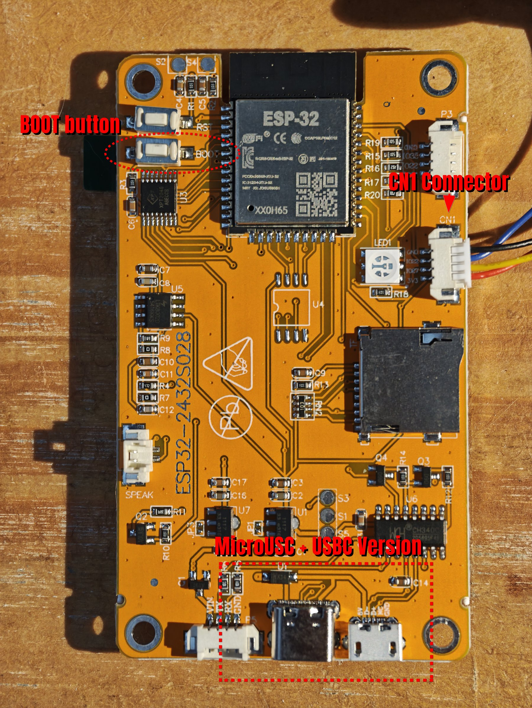

# PocketOBI on the CYD — step-by-step guide

This guide takes you from a bare **CYD** board to a working PocketOBI reading a Makita
LXT pack. No prior ESP32 experience is assumed: every step says what to click, what you
should see, and what to do if you don't.

Allow about **45 minutes** the first time (most of it is installing software once).

> The reference PocketOBI is the ESP32-C3 + encoder build ([README](../README.md)). The
> CYD is an alternative board: same firmware, same screens, driven by touch. Pins and
> build switches are summarised in [CYD_NOTES.md](../CYD_NOTES.md).

---

## Contents

1. [What you need](#1-what-you-need)
2. [Check you have the right CYD](#2-check-you-have-the-right-cyd)
3. [Install the software (once)](#3-install-the-software-once)
4. [Get the PocketOBI code](#4-get-the-pocketobi-code)
5. [Build and flash — option A: PlatformIO (recommended)](#5-build-and-flash--option-a-platformio-recommended)
6. [Build and flash — option B: Arduino IDE](#6-build-and-flash--option-b-arduino-ide)
7. [First power-up](#7-first-power-up)
8. [Wire the battery adapter](#8-wire-the-battery-adapter)
9. [Read your first pack](#9-read-your-first-pack)
10. [Using the touch screen](#10-using-the-touch-screen)
11. [Something went wrong](#11-something-went-wrong)

---

## 1. What you need

| Item | Notes |
|---|---|
| **CYD board** "ESP32-2432S028R", **dual-USB revision** (USB-C + micro-USB) | see step 2 |
| USB cable | **data** cable (some charge-only cables have no data wires) |
| Makita **BL1830 LXT adapter** | the plastic shoe that clips onto the 18 V pack |
| **2 × 470 Ω resistors** | pull-ups for DATA and ENABLE (the value the CYD was validated with) |
| A **4-pin JST 1.25 mm cable** for CN1 | usually supplied with the CYD |
| Some wire, a soldering iron (or a small breadboard) | |
| A Windows, macOS or Linux computer | for the one-time flash |
| A multimeter | only if something doesn't read (step 11) |

The back of the board, with the three things this guide refers to:

[](cyd_board.jpg)

- **BOOT button**: top left, just below RST. Only needed if flashing fails (step 11).
- **CN1 connector**: right edge, pins marked GND · IO22 · IO27 · 3V3. The battery goes here.
- **USB-C + micro-USB**: bottom edge. Two sockets = the right revision (step 2). Either one works.

---

## 2. Check you have the right CYD

Turn the board over and look at the bottom edge (compare with the photo in step 1):

- ✅ **Two USB sockets (one USB-C, one micro-USB)** → this is the revision PocketOBI
  supports (ST7789 display).
- ⚠️ **A single micro-USB socket** → an older revision with a different display chip.
  It will build and flash, but the screen will stay white or show garbage.

Also find the small white 4-pin connector labelled **CN1**. Its pins are printed next to
it: **GND · IO22 · IO27 · 3V3**. That one connector is all the battery needs.

---

## 3. Install the software (once)

You only do this the first time. Pick **one** of the two toolchains:

- **Option A — PlatformIO** (recommended): it downloads the right libraries and versions
  by itself. You type one command to build and flash.
- **Option B — Arduino IDE**: more familiar if you already use it, but you install the
  libraries by hand.

### 3.1 USB driver (Windows only)

The CYD talks to the PC through a **CH340** USB-serial chip. Windows 10/11 usually
installs the driver automatically. To check:

1. Plug the CYD into the PC.
2. Open **Device Manager** → **Ports (COM & LPT)**.
3. You should see **USB-SERIAL CH340 (COMx)**. Note the `COMx` number.

If you see an unknown device with a yellow triangle instead, install the CH340 driver
from the chip maker (WCH), unplug, plug back in, and check again.

### 3.2 Option A — PlatformIO

1. Install **[Visual Studio Code](https://code.visualstudio.com/)**.
2. In VS Code, open the **Extensions** panel (the four-squares icon on the left), search
   for **PlatformIO IDE**, click **Install**. Wait until it says it is ready (the first
   install takes a few minutes), then restart VS Code.

### 3.3 Option B — Arduino IDE

1. Install **[Arduino IDE 2.x](https://www.arduino.cc/en/software)**.
2. **File → Preferences → Additional boards manager URLs**, paste:
   `https://espressif.github.io/arduino-esp32/package_esp32_index.json`
3. **Tools → Board → Boards Manager**, search **esp32** (by Espressif), install a
   **3.x** version. Avoid versions marked *alpha* or *rc*.
4. **Tools → Manage Libraries**, install each of these:
   - **Adafruit GFX Library**
   - **Adafruit ST7735 and ST7789 Library**
   - **RotaryEncoder** (by Matthias Hertel) — not used on the CYD, but the code expects it
   - **XPT2046_Touchscreen** (by Paul Stoffregen), version **1.4**

   Accept "install all dependencies" when asked.

---

## 4. Get the PocketOBI code

**With git:**

```bash
git clone https://github.com/TheRepairforge/PocketOBI.git
```

**Without git:** on the GitHub page, **Code → Download ZIP**, then unzip it.

> ⚠️ The folder that contains `PocketOBI.ino` **must be named `PocketOBI`**. A ZIP
> download is named `PocketOBI-main`: rename it to `PocketOBI`, otherwise the Arduino IDE
> refuses to open the sketch.

---

## 5. Build and flash — option A: PlatformIO (recommended)

1. In VS Code: **File → Open Folder…** and choose the `PocketOBI` folder.
   PlatformIO notices `platformio.ini` and sets the project up (first time: it downloads
   the ESP32 tools, a few minutes).
2. Open a terminal in VS Code: **Terminal → New Terminal**.
3. Plug the CYD into the PC (either USB socket).
4. Build and flash in one go:

   ```bash
   pio run -e cyd -t upload
   ```

5. You should see the build, then `Connecting....`, a percentage climbing to 100 %, and
   finally **`[SUCCESS]`**. The CYD reboots on its own into PocketOBI.

> Always pass `-e cyd`. Without it, PlatformIO builds and flashes
> **every** board in turn, including the ESP32-C3 build, which will not run on a CYD.

If it stops at `Connecting....` and then fails, see
[step 11 — "Failed to connect"](#failed-to-connect--timed-out-waiting-for-packet-header).

---

## 6. Build and flash — option B: Arduino IDE

1. **File → Open…** and choose `PocketOBI/PocketOBI.ino`. A few tabs open (the sketch and its `.h` files); that's normal.
2. **Tell the code it is running on a CYD.** In the `PocketOBI` folder, create a plain
   text file named exactly **`board_local.h`** containing:

   ```cpp
   #define POCKETOBI_BOARD BOARD_CYD
   ```

   > On Windows, make sure the file is not secretly called `board_local.h.txt`
   > (turn on **View → File name extensions** in Explorer).

   Without this file the IDE builds the ESP32-C3 version, and the CYD screen stays black.
3. **Tools → Board → esp32 → ESP32 Dev Module**.
4. **Tools → Port** → the `COMx` you noted in step 3.1 (`/dev/ttyUSB0` or
   `/dev/cu.wchusbserial…` on Linux/macOS).
5. Leave every other Tools setting at its default.
6. Click **Upload** (the → arrow). The first build takes a few minutes.
7. At the bottom you should see `Writing at … (100 %)` then `Hard resetting via RTS
   pin...`. The CYD reboots into PocketOBI.

---

## 7. First power-up

Right after flashing, still on the PC's USB (no battery yet):

1. The **PocketOBI splash** appears, then the **home screen** with four tiles:
   **Battery · Repair · Tools · About**.
2. **Tap a tile.** If the screen reacts where your finger is, you're done with this step.
3. **If taps land in the wrong place** (or nothing reacts), calibrate the touch panel:
   - Tap **Tools** → **Settings** → **Calibrate touch** (if you can't reach it, see
     [step 11](#taps-land-in-the-wrong-place)).
   - Tap each target firmly, with a fingernail or a stylus, as it appears.
   - "Saved" confirms. The calibration is kept across reboots.
4. **Change the language** if you wish: **Tools → Settings → Language** (each tap moves
   to the next one: EN, FR, DE, ES).
5. **Screen upside-down for your enclosure?** **Tools → Settings → Flip screen**.

From now on the CYD does not need the PC: any **USB phone charger or power bank** powers
it.

---

## 8. Wire the battery adapter

> ⚠️ **The pack's B+ contact is at about 18 V. It must never touch the CYD.** One wrong
> wire and the board is dead. Only three battery contacts are used: **DATA, ENABLE and
> B-**.

### 8.1 Find B+ first, so you can stay away from it

With a multimeter on DC volts: black probe on the big **B-** terminal of the pack, red
probe on each contact in turn. The one that reads **~18–20 V is B+**. Mark it, and leave
it unconnected.

### 8.2 The connections

| CYD (CN1) | Goes to | Notes |
|---|---|---|
| **IO22** | battery **pin 2 — DATA** | + a **470 Ω** resistor from IO22 to 3V3 |
| **IO27** | battery **pin 6 — ENABLE** | + a **470 Ω** resistor from IO27 to 3V3 |
| **GND** | the main **B-** terminal | |
| **3V3** | only the two resistors | nothing else |
| — | battery **pin 1 — B+ (18 V)** | **NEVER CONNECTED** |

The two resistors are the part people forget. Without them the board powers up fine but
never sees the pack. Each one simply bridges a signal wire (IO22, IO27) to the 3V3 wire.

> **Why 470 Ω and not the 4.7 kΩ you may see elsewhere?** 4.7 kΩ is the original
> Open Battery Information value. On the 3.3 V ESP32 the pack pulls the DATA line close
> to the switching threshold, and 4.7 kΩ turned out marginal with ordinary hookup wire;
> 470 Ω reads reliably. ENABLE doesn't need it, it just keeps one resistor value.

```
 CYD  CN1                                   Makita LXT adapter
 ─────────                                  ──────────────────
  3V3 ───┬───────────┐
         │           │
       [470]       [470]
         │           │
 IO22 ───┴───────────┼────────────────────► pin 2   DATA
 IO27 ───────────────┴────────────────────► pin 6   ENABLE
  GND ────────────────────────────────────► B-      (main terminal)
                                            pin 1   B+ 18 V   ✗ never
```

> ⚠️ **Some AliExpress adapters number their contacts from the opposite end.** Do not
> trust the numbers moulded in the plastic: confirm B+ with the multimeter (step 8.1),
> and if the pack does not read, swap the DATA and ENABLE wires before anything else.

**Tip:** cut the 4-pin cable that came with the CYD, solder the two resistors at the
cable end (or on a small piece of perfboard), and keep the joints short and insulated with
heat-shrink.

---

## 9. Read your first pack

1. Power the CYD from USB (PC, charger or power bank).
2. Clip the adapter onto a Makita LXT 18 V pack.
3. Tap **Battery**. PocketOBI reads the pack (a second or two) and shows the overview:
   pack voltage, the five cell voltages, temperature, charge count and a verdict.
4. Tap the **left or right edge** of the screen to move between the three Battery
   pages, the **middle** to read the pack again.

If you get **"No battery found"** or **"Comm error"**, go to [step 11](#11-something-went-wrong).

---

## 10. Using the touch screen

The CYD has no knob and no buttons, so a few gestures replace them:

| To… | Tap… |
|---|---|
| open a tile or a menu item | the tile or the item itself |
| go **back** | the **title bar** (the strip at the top of the screen) |
| change page on **Battery** | the **left or right edge** of the screen (previous / next page) |
| refresh the **Battery** reading | the **middle** of the screen |
| continue on the Repair diagnosis | anywhere below the title bar |
| confirm a write (Repair, Reset error) | anywhere below the title bar — see the warning below |

> ⚠️ **On the two confirmation screens (Repair and Reset error), any tap below the title
> bar confirms and writes to the pack.** To cancel, tap the **title bar**. Keep your
> fingers off the screen while it is showing, and don't rest the board face down on a
> bench.

**What's where:**

- **Battery** — live readings and the verdict for the clipped pack.
- **Repair** — clears a *false* charger lockout on a healthy pack. It writes to the
  battery, so it always asks for confirmation first, and it refuses packs with a real
  fault. Read [Unlock / repair](../README.md#unlock--repair) before using it.
- **Tools** — PC bridge, pack LEDs on/off, reset error, raw debug view, and **Settings**
  (flip screen, PC bridge at boot, language, calibrate touch).
- **About** — version and credits.

**PC bridge:** plug the CYD into a PC, open **Tools → PC bridge**, then connect from the
PackScope desktop app. See [TROUBLESHOOTING.md](../TROUBLESHOOTING.md) if it doesn't connect.

---

## 11. Something went wrong

### Failed to connect / "Timed out waiting for packet header"

The flasher can't put the board into download mode by itself.

1. Start the upload again.
2. As soon as `Connecting....` appears, **press and hold the BOOT button** on the CYD
   (back of the board, top left, just below RST, see the photo in step 1), release it once the percentage starts climbing.
3. Still failing: try the other USB socket, another cable (a data cable), and close
   anything else that might be using the port (Arduino serial monitor, PackScope, Cura…).

### No COM port appears

- Cable is charge-only → try another one.
- Driver missing → step 3.1.

### The screen stays black after flashing

- Arduino IDE: `board_local.h` missing, misnamed (`.h.txt`), or not in the `PocketOBI`
  folder → the C3 build was flashed. Fix it and upload again.
- PlatformIO: you flashed `-e esp32-c3` → flash `-e cyd`.

### The screen stays white or shows garbage

Single micro-USB CYD (older revision, different display chip) → see step 2.

### Taps land in the wrong place

Run **Tools → Settings → Calibrate touch**. If you can't hit those items at all, tap
around the bottom-right area of a tile until one opens, then use the title bar to go
back and work your way to Settings. Tap firmly: the panel is resistive and needs a little
pressure, a fingernail works best.

### "No battery found" / "Comm error"

Almost always wiring, not the firmware — flashing again won't change it. In order:

1. Is **B-** really connected to **GND**?
2. Are both **470 Ω pull-ups** fitted (IO22 → 3V3 and IO27 → 3V3)?
3. Are **DATA and ENABLE swapped**? Swap them and try again (see the warning in step 8.2).
4. Is the adapter fully clipped on, contacts clean?

The full multimeter procedure is in **[TROUBLESHOOTING.md](../TROUBLESHOOTING.md)**: it
uses the C3 pin names; on the CYD read **IO22** for DATA and **IO27** for ENABLE.

### See what the board is saying

Plug into the PC and open a serial monitor at **115200 baud**:

```bash
pio device monitor
```

(or the Arduino IDE serial monitor). The boot log and any read error are printed there;
include it if you ask for help.
